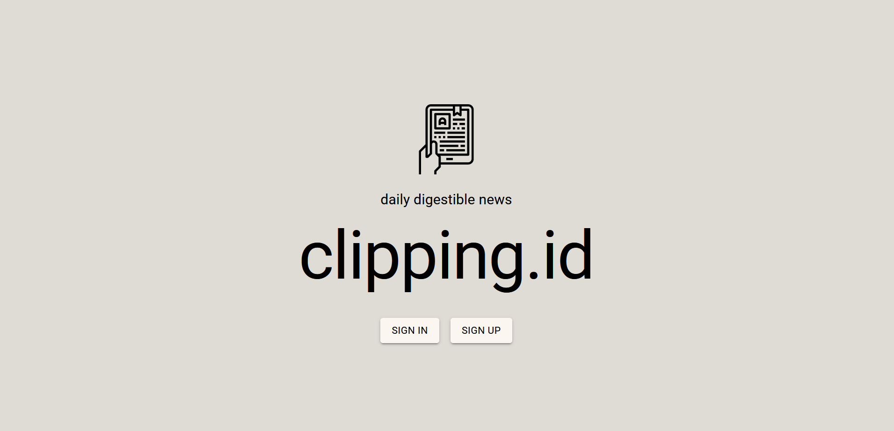
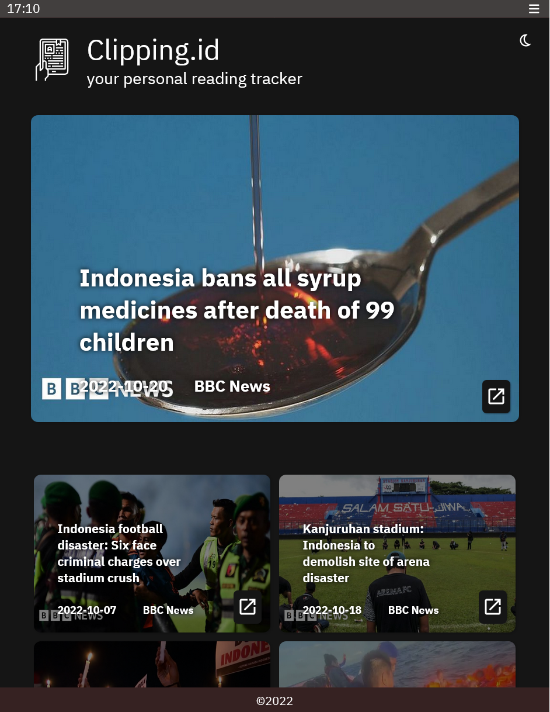

<h1 align="center">
  <br>
    </a>
  <br>
  Clipping.id
  <br>
</h1>

<h4 align="center">A minimalist news aggregator built on with <a href="https://reactjs.org/" target="_blank">ReactJS</a>.</h4>

 

***



***

# Demo


[Live Demo](https://is.gd/0PNYYT)

***

## Fitur Wajib

[ x ] Login  
[ x ] Logout  
[ x ] Register  
[ x ] Halaman Utama  
[ x ] Halaman Detil  
[ x ] Fitur unik diluar pembelajaran  


## Fitur Tambahan

[ x ] Dark/ Light Mode   
[ x ] Modular Toast Notification  
[ x ] Pop-up Detail News  
[ x ] App Bar Clock & Dynamic Copyright Year

## Lain-Lain

[ x ] Touch screen friendly  
[ x ] Responsive design (laptop, tablet, smartphone)

API yang digunakan -> https://berita-indo-api.vercel.app/v1/

## Testing

```bash
# sample account
email address = test@test.com
password      = testing
```